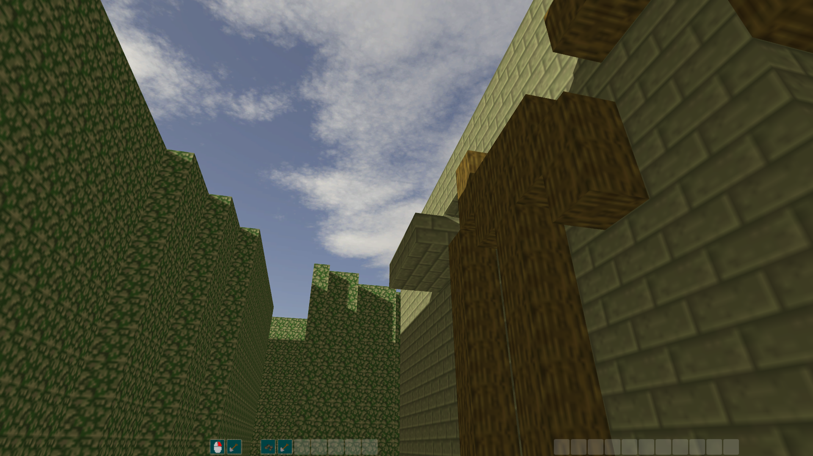
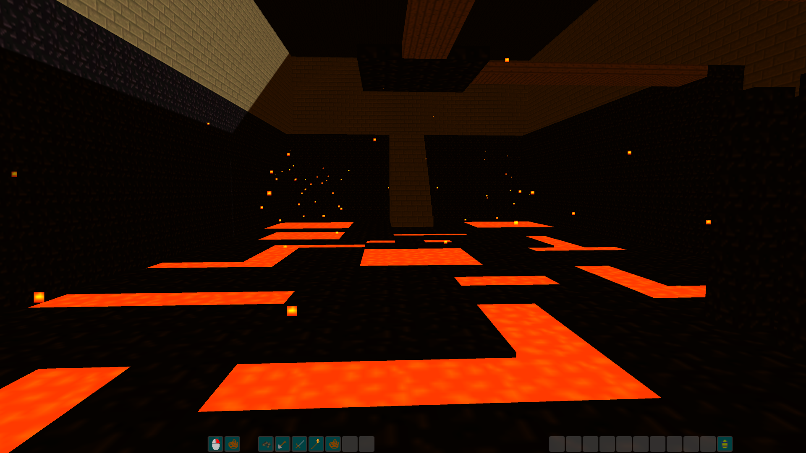
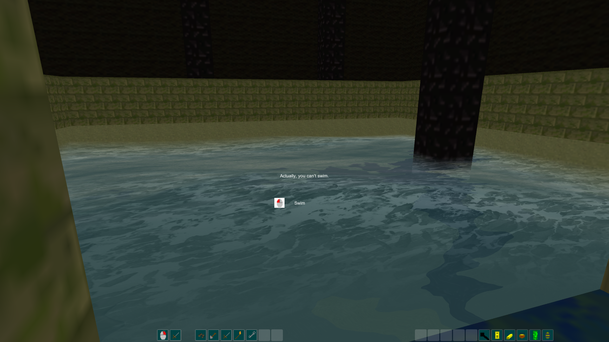
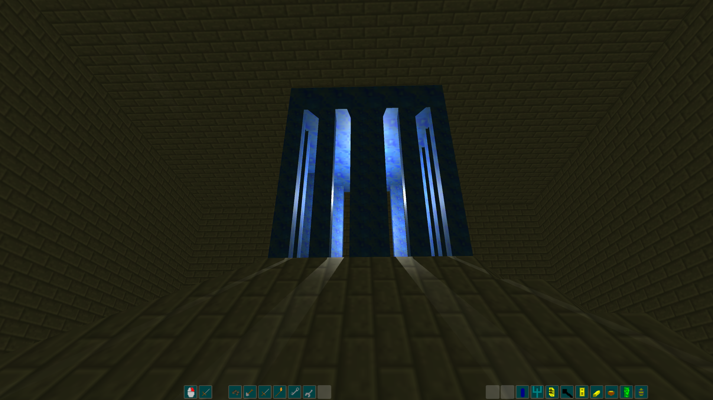
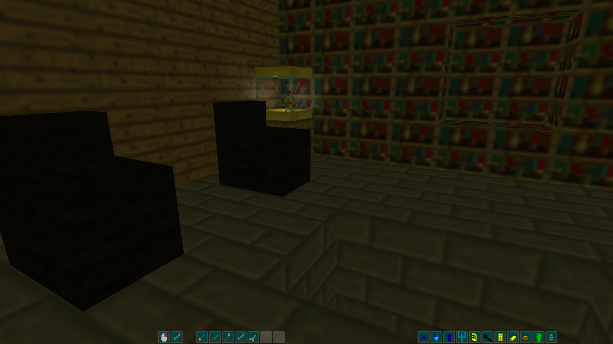

# 3D Zork Unity

3D Zork Unity is a Unity port of a game called 3D Zork, originally made by https://github.com/mdepp and myself when we were in junior high. Most of the textures and sounds a came from other games (I use them here for educational purposes only) however the level editor was custom built (hence why the levels look so crappy).

The Unity version was made by myself in about a week.

